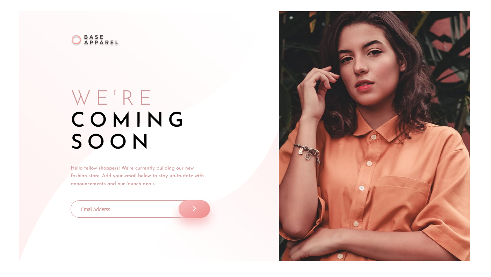
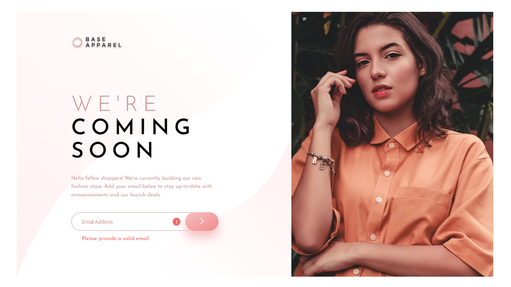
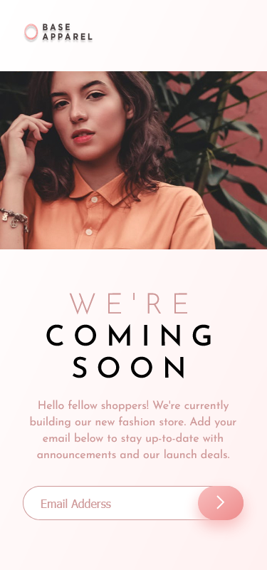
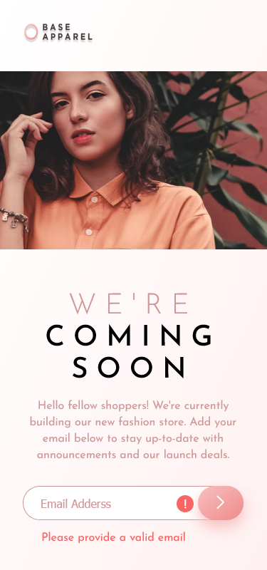

# Frontend Mentor - Base Apparel coming soon page solution

This is a solution to the [Base Apparel coming soon page challenge on Frontend Mentor](https://www.frontendmentor.io/challenges/base-apparel-coming-soon-page-5d46b47f8db8a7063f9331a0). Frontend Mentor challenges help you improve your coding skills by building realistic projects.

## Table of contents

-   [Overview](#overview)
    -   [The challenge](#the-challenge)
    -   [Screenshot](#screenshot)
-   [My process](#my-process)
    -   [Built with](#built-with)
    -   [What I learned](#what-i-learned)
    -   [Continued development](#continued-development)
-   [Author](#author)

## Overview

This newbie-level challenge was easy to complete. It's a project for launching a fashion store where users can enter their email to receive updates. The design includes an information box with a title, description, and email input field, alongside a photo of a model. On mobile, the layout shows the title, the model's photo, the description, and the email box in sequence. There’s an animation if the user submits the form without including "@" in the email or leaves the email field empty.

### The challenge

Users should be able to:

-   View the optimal layout for the site depending on their device's screen size
-   See hover states for all interactive elements on the page
-   Receive an error message when the `form` is submitted if:
    -   The `input` field is empty
    -   The email address is not formatted correctly

### Screenshot

## My process

I’m working on Frontend Mentor projects using Figma. First, I analyzed what I needed to do and where to start. So far, all the Frontend Mentor projects I’ve tackled have a desktop layout width of 1440px. I started the main section with this width, adjusted the hierarchy and boxes for a desktop-first workflow, and styled them. For CSS, I prioritize using very specific selectors, starting from the top-level parent, so that in larger projects, I’m already accustomed to avoiding conflicts between style selectors.

When moving on to JS, I revisited the HTML to add `id` attributes and included text and icon tags that appear when the email input is empty or missing the "@". Then, I implemented the logic to show these elements when the input is invalid.

### Built with

-   Semantic HTML5 markup
-   Position Relative
-   Desktop-first workflow

### What I learned

I’m learning that sometimes the issue isn’t with my logic or intelligence but a small error preventing the code from functioning. In this project, I spent 15 minutes reviewing and researching, only to find the issue was a missing set of parentheses in a function call.

### Continued development

I plan to continue improving my web design skills through Frontend Mentor. Even at the newbie level, I learn new things. I’m focusing on JS for now, and in the future, I’ll work with APIs, including 3D APIs, which I find fascinating. After Frontend, I’ll move on to backend development.

## Author

-   Instagram - [@fred_alves23](https://www.instagram.com/fred_alves23/)
-   Frontend Mentor - [@FredericoGarciasAlves](https://www.frontendmentor.io/profile/FredericoGarciasAlves)
-   Twitter - [@FredericoGA70](https://x.com/FredericoGA70)
-   Threads - [@fred_alves23](https://www.threads.net/@fred_alves23)
